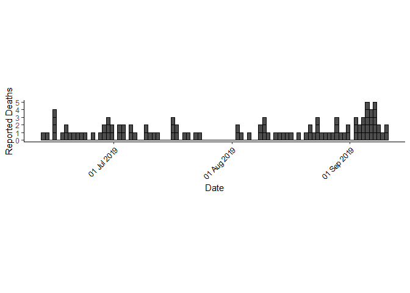
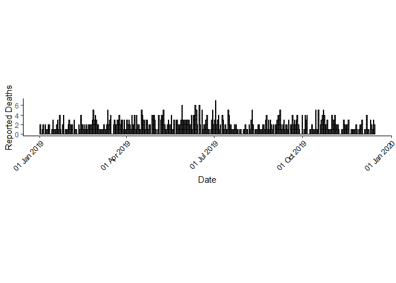

---
title: 'From Scripts to Projects: Learning a Modular, Auditable, and Reproducible
  Workflow'
author: "Jessica Randall"
output:
  bookdown::html_document2:
    keep_md: yes
    theme: "paper"
    highlight: "default"
    toc: yes
---


## Introduction {-}

When I first learned about [Dr. Patrick Ball's](https://hrdag.org/people/patrick-ball-phd/) work contribuitng statistical evidence to the conviction of Slobodan Milosevic I had been taking statistics courses in my graduate program at the Rollins School of Public Health at Emory University. I was immediately inspired. I mentioned Patrick's work and that he had co-founded HRDAG with [Dr. Megan Price](https://hrdag.org/people/megan-price-phd/) to a mentor at Emory and found out how small the world is. My own mentor had also been one of Megan's. I have had the pleasure of chatting with both Megan and Patrick over the last year and I was thrilled when Patrick asked if I would assist on an HRDAG project. 

Having only formally learned SAS for a couple of years and dabbled in Python and R for a handful of months, HRDAG's principled data processing [workflow](https://hrdag.org/2016/06/14/the-task-is-a-quantum-of-workflow/) was initially intimidating. I admit to my R code looking very much like the amateur examples in [Tarak's](https://hrdag.org/people/tarak-shah/) recent [post](https://hrdag.org/tech-notes/harmful.html). 

With the import of what our answer could mean for our client's activism in mind and a great deal of Patrick's guidance I shifted towards working mainly in the command line, learning Vim, and thinking of scripts in terms of a larger project architecture. For this project I used R Studio to prototype new ideas and Microsoft Visual Studio Code with a Vim extension to make it production-ready and push it to the project Github repository. As I worked, Patrick also encouraged me to keep notes on process. The modular nature of the workflow and use of Git allowed us to work on different parts of the project from across the country without worrying about out of date bits of code from an email chain. The following post summarizes those notes and the work that went into determining the answers to our client's question.

At the risk of falling into the caveat fallacy, any conclusions we came to as a result of our analyses are contingent on these data being true and come with the caveat that we don't know what we don't know.

To begin the project, we started with a task. Each task is a microcosm of the entire project and at HGRAG this facilitates the team's collaboration across time zones and programming languages. It also results in projects which are auditable and reproducible. Anyone looking at the code can determine exactly how output was produced and anyone working on a task at anytime can pick it up and recreate the same output. This project included the following  five tasks; `import/`, `clean/`, `test/`, and `write/`. Each with its own Makefile, input folder for files coming into the task, output folder for files produced by the task, and src folder for source code to do the task. 

To make the goals of each task clear, each task has a Makefile. The Makefile serves as an outline of each task not only for our benefit, but mainly for the computer to read and execute. Each file can be run from a command line terminal simply by calling "make `[name of task]/`. Imagine being able to work on a group project with team members around the world, and still have an auditable trail of each person's work. The Makefile acts as clear and traceable scaffolding. For more information on Makefiles check out Mike Bostock's [post](https://bost.ocks.org/mike/make/) and Jenny Bryan's [post](https://www.tidyverse.org/blog/2017/12/workflow-vs-script/). Writing and using Makefiles for the first time was probably one of the most challenging aspects of learning this workflow but it was extremely rewarding to see the whole project work with (practically) one click. 

## Import {-}

I start with `import/`. This is the task in which we directly place the data we received from client. Data we receive are placed in the input folder, acted on by the code in the src folder via the Makefile, and outputs are placed in the cooresponding output folder.

## Clean {-}

For this task I pulled the datasets directly from the output folder of the import task. The src folder contains the R code to clean up the data, and the output folder contains the clean data ready to be used in `test/`. 

The first data set includes initial deaths reported from 12 June 2019 -- 10 September 2019. The second file contains deaths reported from 1 January 2019 -- 14 December 2019. Our client requested us to determine if the number of deaths reported during a specific time period was unusually high following a specific date of interest. 

To clean the data, we make sure that we don't have strings of text where we expect to see numbers and vice-versa using informal unit tests. This means that instead of running the code and interactively checking the dimensions or the top 5 rows of a data set visually, we use the [assertr](https://cran.r-project.org/web/packages/assertr/index.html) package to specify some condition the data has to meet and tell our code to stop running if that condition is not met. This allows us to run `make` with confidence that our output will look as expected or it will not run at all. 

We also canonize the data. This means ensuring that the names of the variables we are comparing are standard across the data sets if we were to combine them. We are working with two data sets and since they likely overlap in terms of which deaths reported they contain, we'd like to keep them separate while still having variables named consistently.

Since we are interested in examining only those cases in which people have been reported as dead, we remove all rows where the person's status is "Not_death". We are also interested in reported deaths occurring prior to or following a specific date so we created a variable indicating whether or not a death occurred prior to or following that date. 

The modularity of the workflow had the added benefit of making it feel as though I had made progress as I finished each task instead of staring down the endless empty field of .R file. 


```r
files <- list(input1=here::here("clean/output/deaths1.csv"),
              input2=here::here("clean/output/deaths2.csv"))

death1 <- readr::read_delim(files$input1, delim="|")

death2 <- readr::read_delim(files$input2, delim="|")
```

## Epi Curve 1 {-}

We used an epi curve plotted with the help of the [incidence](https://www.repidemicsconsortium.org/incidence/) package to see if an abnormally high number of deaths reported per day would be immediately apparent. Epi curves are used in investigations of potential outbreaks and their shapes suggest a means of propagation; curves for infections transmitted from person to person have different shapes than curves of diseases transmitted from a water source, for example. 

In our data, if an epidemic of deaths were being reported, we would expect to see a spike in the number of deaths reported per day somewhere in the curve.

Since these graphs require relatively short blocks of code and don't require major changes to the data, I did not make them a separate task.

<!-- -->

This pattern suggests reported deaths per day increased in the beginning of June and end of August into September. However, with such a small group of people in such a small amount of time, it is not clear that these numbers are abnormally high since we don't know what normal looks like for this population.

Let's examine the 2nd, larger set of data over a longer time period.

## Epi Curve 2 {-}

<!-- -->

Now we have big(ger) data and this graph suggests that reported deaths per day increased in June or July. However, with more data it appears even less clear if the days on which higher numbers of deaths are reported are outside of the normal variation for this population.

Looking at these graphs I found it humbling knowing they represented individual people whose deaths may or may not have been related to important events. I felt the moral responsibility to each person and I wanted to do the best work technically possible to honor the work being done by our client to investigate these deaths. I felt extremely privileged to work on this project and breaking down each part of it into modular tasks helped me compartmentalize and focus. No matter your area of research, there might be times when being able to walk away for a bit and pick up right where you left off is a huge relief.

With data in the human rights context it can be difficult to obtain reliable information of a particular outcome of interest, especially if some powerful group has an interest in that data not existing or it was simply never collected. Since we do not have any data on the underlying rates of actual deaths in this population, we tried a more classical statistical approach.

## Test {-}

These reported deaths are counts of events collected in a specific time period. This means they can be assessed in the context of whether or not they represent a discrete random variable in a Poisson distribution. Data which follow a Poisson distribution exhibit expected amounts of variation around the mean number of events in a given time period with the assumption that each death reported is independent of any other death reported. 

We test the null hypothesis that the mean number of reported deaths does not differ significantly following a date of interest. Our client would then, hopefully, be able to use our findings as a tiny footnote in the larger context of their work. 

To test this hypotheses, we call in data from the aptly named `test/` task. We prepared our data for this task by obtaining the frequency of deaths reported per day. Since at least one death wasn't reported at least once per day we also added in dates where we had no reported deaths with frequencies of zero so we don't bias our results away from not rejecting the null hypothesis if we shouldn't.

We use the poisson.test function in R's [stats](https://www.rdocumentation.org/packages/stats/versions/3.6.2) package to determine if the differences in the means prior to and following our date of interest, 21 August 2019, are significantly different from one another at the 95% confidence interval. Since we have reason to believe that the frequency of deaths reported per day would increase rather than decrease following this date, we use a one-sided test of the upper limit of the probability distribution. If we observe a p-value < 0.05, we would reject our null hypothesis. A rejection of the null suggests that the observed mean frequency of reported deaths following the date of interest is abnormally high.


```r
files <- list(cts1 = here::here("test/output/counts1_pre.txt"),
              cts2 = here::here("test/output/counts1_post.txt"),
              cts3 = here::here ("test/output/counts2_pre.txt"),
              cts4 = here::here ("test/output/counts2_post.txt")
              )

cts1pre <- readr::read_delim(files$cts1, delim="|")
cts1post <- readr::read_delim(files$cts2, delim="|")
cts2pre <- readr::read_delim(files$cts3, delim="|")
cts2post <- readr::read_delim(files$cts4, delim="|")

# mean prior to 21 August 2019
mu1pre <- round(mean(cts1pre$n))

# mean following 21 August 2019
mu1post <- round(mean(cts1post$n))

# mean prior to 21 August 2019
mu2pre <- round(mean(cts2pre$n))

# mean following 21 August 2019
mu2post <- round(mean(cts2post$n))

#test
res1 <-poisson.test(mu1pre, 1, mu1post, alternative = "g", conf.level = 0.95)

res2 <- poisson.test(mu2pre, 1, mu2post, alternative = "g", conf.level = 0.95)
```

In the first data set, prior to 21 August 21 2019, there was an average of 1 death reported per day. Following 21 August 2019 there was an average of  2 deaths reported per day. We cannot reject the hypothesis that the mean number of deaths reported after 21 August 2019 is not significantly greater than the mean number of deaths reported prior to 21 August 2019 at the 95% confidence interval (p = 0.86). 

In the second data set, prior to 21 August 21 2019, there was an average of 2 deaths reported per day. Following 21 August 2019 there was an average of  2 deaths reported per day. We cannot reject the hypothesis that the mean number of deaths reported after 21 August 2019 is not significantly greater than the mean number of deaths reported prior to 21 August 2019 at the 95% confidence interval (p = 0.60). 

Working on the uncertain assumption that this is a reliable list of deaths, the frequency of deaths reported during this time period is consistent with what we would expect to see with a normally occurring random process, that is, nothing we’re seeing from these data indicates anything out of the ordinary. I will admit to being incredibly relieved but also waking up in a cold sweat regularly hoping I hadn't made some terrible mistake and arrived at the wrong conclusion. After all, bad data analysis is worse than none at all.

## Write {-}

Finally, in what struck me as the coolest technical part of this process, is the `write/` task. This entire post was generated from an R markdown file stored in the `write/` task's src folder. Now I want to write as many [reports](https://bookdown.org/yihui/bookdown/) and [presentations](https://bookdown.org/yihui/rmarkdown/powerpoint-presentation.html) as I can this way. A detail I found especially fun is the use of embedded variables. Throughout this post I've included statistics about this data set. If we suddenly received more data and I had to regenerate this report, instead of having to manually check that each number I cited was updated and typed correctly, I could drop the files into the `clean/` task's import folder and update the entire report with the knowledge that all of those variables would be correct.

## Acknowledgements {-}

Collaborating with HRDAG, specifically Dr. Patrick Ball, on this project has been an incredible learning opportunity. Throughout this project I began learning how to look at data analysis from the very macro ("How many tasks do I have?") to the very micro ("Can I pipe this line?") levels. I began to learn how to use the distance inherent in the job of looking at data points and the modularity of the workflow to help me stay focused. This has resulted in a fundamental shift in the way I work and I will continue to learn and improve in using this process as I move forward in my career. As a statistician I am used to having a comfortable amount of psychological distance from the people my work is impacting. Rather than seeing this distance in opposition to the ability to do strong work, it is absolutely necessary that I have it to do the best work technically possible. Working on this project was like a coding bootcamp and professional trial by fire in the best way possible. I learned more than I ever imagined about both the technical and personal aspects of statistics in human rights work and my dearest hope is that that the conclusions we came to were useful in suporting our client's work on the ground.

The project architecture structure discussed in this post, with discrete tasks using Makefiles, was developed by [Drs. Scott Weikart](https://hrdag.org/people/scott-weikart-phd/) and [Jeff Klingner](https://hrdag.org/people/jeff-klingner-phd/) and formalized around 2007. I am incredibly grateful for Tarak Shah's motivating post on the dangers of .Rproj style of project management, for [Dr. Amelia Hoover Green's](https://hrdag.org/people/amelia-hoover-green-phd/) detailed post on what it means to clean and canonize data, Dr. Megan Price's encouragement to work in this field, and Dr. Patrick Ball's invitation to collaborate, his patient explanations, and detailed feedback throughout this project.


<!---- done ---->
